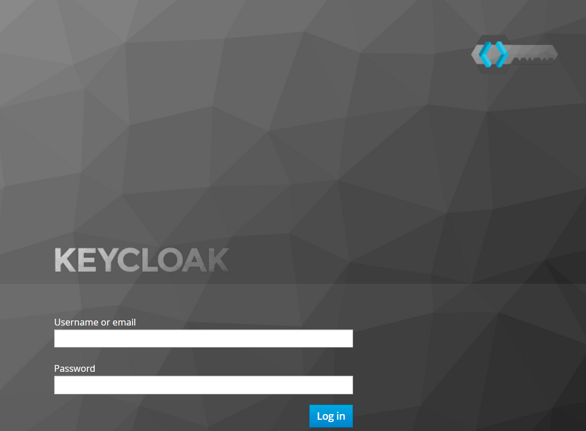

# keycloak-springsecurity5-sample

Spring Security 5 brought new OAuth2/OIDC client instead of the legacy client support in the old Spring Security OAuth sub project. The new 
OAuth2 umbrella modules in the core project will replace the old Spring Security OAuth, Spring Social etc.  In the further 5.1, OAuth2 authorization server and resource server are planned to implement, check the [OAuth2 related issues on Github ](https://github.com/spring-projects/spring-security/issues?q=is%3Aissue+is%3Aopen+label%3AOAuth2). 

Spring Security 5 OAuth2 client has built-in supports for facebook, github, okta, Google etc, unlike Spring Social, in this new client, Spring Security 5 provides a generic solution for client registration, thus you can configure any OAuth2/OIDC providers without codes.

A new [oauth2login sample](https://github.com/spring-projects/spring-security/tree/master/samples/boot/oauth2login) is added in Spring Security source codes to demonstrate the newest OAuth2 client.

In this post, we will fork this sample, and try to start up a local keycloak server and configure it as a custom OAuth2/OIDC provider in our project.

## Setup local keycloak server

To simplify the work, I prepared a `docker-compose.yml` file to start keycloak server in a single command.

```yaml 
version: '3.3' 

services:    
     
  keycloak:
    image: jboss/keycloak
    ports:
      - "8000:8080"
    environment:
      - KEYCLOAK_LOGLEVEL=DEBUG
      - PROXY_ADDRESS_FORWARDING=true
      - KEYCLOAK_USER=keycloak 
      - KEYCLOAK_PASSWORD=keycloak
    depends_on:
      - mysql
      
  mysql:
    image: mysql
    environment:
      - MYSQL_ROOT_PASSWORD=root
      - MYSQL_DATABASE=keycloak
      - MYSQL_USER=keycloak
      - MYSQL_PASSWORD=password
    volumes:
      - ./data/mysql:/var/lib/mysql

```

Start up keycloak by `docker-compose` command.

```
docker-compose up
```

## Register client app in keycloak

When keycloak is started, open your browser and navigate to http://localhost:8000 or http://&lt;docker-machine ip&gt;:8000 if you are using a docker machine.

1. Create a new schema: **demo**.
2. Switch to the new **demo** schema in the dropdown menu.
3. Create a client app: **demoapp**.
4. Create a new user for test purpose.


## Configure keycloak in our application

Generate a new project via [Spring Initializr](http://start.spring.io) or fork the official [oauth2login sample](https://github.com/spring-projects/spring-security/tree/master/samples/boot/oauth2login) as start point.


Add a new *keycloak* node under the *spring/security/oauth2/client* node in the *application.yml* file.


```yaml
spring:
  security:
    oauth2:
      client:
        registration:
          keycloak:
            client-id: demoapp
            client-secret: demoapp
            clientName: Keycloak
            authorization-grant-type: authorization_code
            redirectUriTemplate: '{baseUrl}/login/oauth2/code/{registrationId}'
            scope:
              - openid
              - profile
              - email
        provider:
          keycloak:
            authorization-uri: http://localhost:8000/auth/realms/demo/protocol/openid-connect/auth
            token-uri: http://localhost:8000/auth/realms/demo/protocol/openid-connect/token
            user-info-uri: http://localhost:8000/auth/realms/demo/protocol/openid-connect/userinfo
            jwk-set-uri: http://localhost:8000/auth/realms/demo/protocol/openid-connect/certs
            user-name-attribute: preferred_username


```

For custom OAuth2 provider, you have to configure the details of the OAuth2 **provider**, and provides the details of client **registration** for OAuth client support.

Bootstrap the application by `mvn spring-boot:run` or run it in IDE directly, then navigate to http://localhost:8080 in your browser.


You will find a new **Keycloak** link added in our application login page.

1. Click the Keycloak link, it will guide you to redirect to keycloak login page.

    
	
2. Use the user/password we have created in the last step to login. 
3. if it is successful, it will return back to our application home page.

    

4. Click the **Display User Info** link, it will show all user attributes from `/userinfo` endpiont exposed by keycloak.

    


Check out the [source codes](https://github.com/hantsy/keycloak-springsecurity5-sample) from my github account.	


    